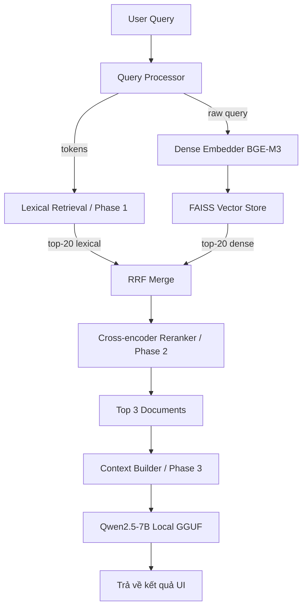

# HUFLIT Information Retrieval System
**Hệ thống Tìm kiếm Thông minh – portal.huflit.edu.vn**

---

## 0. TỔNG QUAN HỆ THỐNG

Hệ thống IR xây dựng để tìm kiếm thông tin từ cổng thông tin sinh viên HUFLIT. Người dùng nhập query bằng tiếng Việt tự nhiên → hệ thống xử lý → trả về kết quả mượt mà và chính xác nhất bằng công nghệ RAG.

**Ba giai đoạn triển khai (Advanced RAG Pipeline):**
- **Phase 1 – Core IR (Lexical Retrieval):** Crawl data → Index → Lọc thô bằng TF-IDF/BM25/LM Dirichlet → Trả về top-K candidate documents.
- **Phase 2 – Hybrid Retrieval & Re-ranking:** Kết hợp Dense Vector Search (FAISS) với Lexical Search thông qua RRF (Reciprocal Rank Fusion) → Chấm điểm chéo (Cross-encoder Reranking) tìm ra top-3 tài liệu xuất sắc nhất.
- **Phase 3 – RAG (Retrieval-Augmented Generation):** Context Builder ghép tài liệu → LLM đọc ngữ cảnh và sinh câu trả lời tiếng Việt có đính kèm context.

---

## 1. CÂY CẤU TRÚC DỰ ÁN

```
huflit-ir-system/
├── README.md
├── HISTORY.md
├── TODO.md                           ← HƯỚNG DẪN SỬ DỤNG CHI TIẾT
├── requirements.txt
├── .env.example
├── test_search.py                    ← Script test pipeline qua terminal
├── repair_hf_cache.py                ← Sửa lỗi HF cache trên Windows
│
├── models/                           ← AI MODELS (LOCAL/OFFLINE)
│   ├── Qwen2.5-7B-Instruct-Q4_K_M.gguf   ← LLM 4.3GB (Phase 3)
│   └── bge_cache/                         ← HuggingFace cache
│       └── models--BAAI--bge-m3/          ← Embedding model 2.27GB (Phase 2)
│
├── crawler/
│   ├── spider.py
│   ├── parser.py
│   ├── cleaner.py
│   ├── scheduler.py
│   └── config.py
│
├── scripts/
│   ├── generate_corpus_new.py        ← Trích xuất date → corpus_new.json
│   ├── build_index.sh
│   ├── run_crawler.sh
│   └── start_api.sh
│
├── data/
│   ├── raw/
│   ├── processed/
│   │   ├── corpus.json                ← Dataset gốc (193 tài liệu, chỉ title/content/url)
│   │   └── corpus_new.json            ← Dataset nâng cấp (+ id, category, date)
│   └── index/
│       ├── inverted_index.pkl
│       ├── tfidf_matrix.npz
│       ├── bm25_params.json
│       ├── faiss_index.bin            ← FAISS Dense Vector Index (BGE-M3)
│       ├── dense_doc_ids.json
│       ├── doc_ids.json
│       ├── doc_lengths.json
│       └── vocab.json
│
├── indexer/
│   ├── tokenizer.py
│   ├── inverted_index.py
│   ├── tfidf.py
│   ├── bm25.py
│   ├── vector_store.py           ← Embed corpus → FAISS (BGE-M3)
│   └── build_index.py
│
├── retrieval/                    ← Phase 1 & 2
│   ├── query_processor.py
│   ├── lexical_retrieval.py      ← Phase 1 (TF-IDF + BM25 Scorer)
│   ├── embedder.py               ← Phase 2 (BGE-M3 Query Encoder)
│   ├── rrf_merge.py              ← Phase 2 (RRF Merger)
│   └── reranker.py               ← Phase 2 (Cross-encoder Reranker)
│
├── rag/                          ← Phase 3
│   ├── context_builder.py
│   ├── answer_generator.py       ← Qwen2.5-7B Local (llama.cpp)
│   └── prompt_templates.py
│
├── api/
│   ├── main.py                   ← FastAPI entrypoint
│   └── routes/
│       └── search.py             ← POST /search endpoint
│
└── frontend/
    ├── index.html                ← Giao diện SPA
    ├── app.js                    ← Logic gọi API + render kết quả
    └── style.css                 ← Styling premium
```

---

## 2. MÔ TẢ CHI TIẾT TỪNG FILE

### 2.1 crawler/

**spider.py / parser.py / cleaner.py / scheduler.py / config.py**
Đóng vai trò thu thập, bóc tách và làm sạch dữ liệu từ cổng `portal.huflit.edu.vn`. Dữ liệu cuối cùng được chuẩn hoá và lưu vào `data/processed/corpus.json`.

---

### 2.2 data/

Lưu trữ HTML gốc và dữ liệu đã xử lý:
- **`corpus.json`** — Dataset gốc (193 docs): chỉ có `title`, `content`, `url`.
- **`corpus_new.json`** — Dataset nâng cấp: thêm `id` (huflit_XXXX), `category` (cần fill thủ công), `date` (tự trích xuất, 139/193 docs có date, 54 docs null).
- **`data/index/`** — Các file chỉ mục đã build: BM25 params, Inverted Index, TF-IDF matrix, FAISS vectors, vocab, doc_ids.

---

### 2.3 indexer/

**tokenizer.py**
Tokenize tiếng Việt bằng `underthesea`. Có **Unigram Fallback**: compound token (VD: `tích_điểm`) tự động tách thêm từ đơn (`tích`, `điểm`) để tăng recall.
**inverted_index.py / tfidf.py / bm25.py**
Tạo và serialize các model Sparse. Dùng thuật toán TF-IDF (bigram), BM25 Okapi (k1=1.5, b=0.75), Inverted Index.
**build_index.py**
File tổng hợp để chạy Indexing. Có **Title Boosting**: title tokens được lặp 3 lần (`title_tokens * 3 + content_tokens`) để BM25/TF-IDF ưu tiên match title.
**vector_store.py**
Nhúng (Embed) document thành Dense Vector bằng BGE-M3 → FAISS ANN index. Doc IDs dùng format `huflit_XXXX` đồng bộ với Lexical index.

---

### 2.4 retrieval/ (Phase 1 & Phase 2)

**query_processor.py**
Tiền xử lý: lowercase → tokenize (với unigram fallback) → remove stopwords → synonym expansion.
**entity_extractor.py** *(chưa tích hợp vào pipeline chính)*
Tách Named Entities (SEMESTER, MONEY, MAJOR) — sẽ dùng cho category filtering trong tương lai.
**exact_match.py** *(chưa tích hợp vào pipeline chính)*
Boolean search với ngoặc kép "".

**lexical_retrieval.py** (Phase 1)
Tính điểm Sparse: tìm candidates qua TF-IDF + BM25. Trả về top-K lexical candidates.
**embedder.py** (Phase 2)
Encode user query thành dense vector (sử dụng Multilingual model).
**rrf_merge.py** (Phase 2)
Thuật toán Reciprocal Rank Fusion kết hợp list từ lexical_retrieval (Phase 1) và vector_store (Dense tìm kiếm). Gộp các rank khác hệ quy chiếu một cách chuẩn xác theo thứ hạng.
**reranker.py** (Phase 2)
Sử dụng mô hình Cross-encoder để đánh giá lại (re-rank) tập top-10 nhận được từ `rrf_merge.py`, chắt lọc ra top-3 xịn nhất.

---

### 2.5 rag/ (Phase 3)

**context_builder.py**
Nhận top-3 document từ reranker. Ghép title + snippet của từng doc thành một context string.
**answer_generator.py**
Giao tiếp với mô hình LLM Local **Qwen2.5-7B-Instruct** (GGUF format) qua thư viện `llama-cpp-python`. Load file `.gguf` vào RAM, dùng ChatML format để sinh câu trả lời tiếng Việt mạch lạc. **Chạy 100% Offline, không cần API key.**
**prompt_templates.py**
Định nghĩa sẵn các khung Prompt tối ưu cho việc truy xuất thông tin (cấm bịa đặt, chỉ dùng document context cung cấp, phải đính kèm source link).

---

### 2.6 api/ & frontend/

**api/main.py, routers/search.py**: Server FastAPI xử lý search request.
**frontend/index.html**: Giao diện người dùng có search bar hiển thị sinh RAG answer.

---

## 3. CẤU TRÚC DATASET

Xem chi tiết tại `CauTrucDataSet.md`. Schema hiện tại (`corpus_new.json`):
```json
{
  "id": "huflit_0001",
  "title": "Thông báo tuyển sinh đại học chính quy năm 2024",
  "content": "Trường Đại học Ngoại ngữ - Tin học TP.HCM thông báo...",
  "url": "https://portal.huflit.edu.vn/tuyen-sinh/dai-hoc-2024",
  "category": "Tuyển sinh",
  "date": "2024-03-15"
}
```
- `category`: mặc định "Thông báo chung" nếu không xác định. Cần fill thủ công.
- `date`: format YYYY-MM-DD, `null` nếu không parse được. Tokens không lưu trong corpus — tính on-the-fly khi build index.

## 4. IR KEYWORD → MODULE MAPPING

| Keyword | File | Cách triển khai |
|---------|------|-----------------|
| Inverted Index, TF-IDF | indexer/*.py | Sparse vectors lưu disk cho Lexical phase |
| Lexical Retrieval | retrieval/lexical_retrieval.py | Scoring query-docs bằng BM25 / TF-IDF / LM. |
| Hybrid Retrieval & RRF | retrieval/rrf_merge.py | Merge Dense + Sparse dựa trên Reciprocal Rank Fusion |
| Re-ranking (Cross-encoder)| retrieval/reranker.py | Tính Relevance score đôi (Query, Doc) có chi phí cực cao nhưng chính xác trên file top K. |
| RAG | rag/answer_generator.py | Retrieval-Augmented Generation trả câu trả lời tự nhiên qua LLM |

---

## 5. PIPELINE XỬ LÝ QUERY THEO CẤU TRÚC MỚI

### Phase 1: Core IR (Lexical Retrieval)
```
User nhập query
    ↓
[query_processor.py]    lowercase → tokenize (+ unigram fallback) → remove stopwords → synonym expand
    ↓
[lexical_retrieval.py]  tìm candidate docs bằng TF-IDF + BM25 (title đã được boost 3x)
    ↓
Trả về top-K lexical candidates
```

### Phase 2: Hybrid Retrieval + Re-ranking
```
User query
    ↓
[embedder.py]           query → dense vector (BGE-M3 multilingual)
    ↓
[FAISS index]           ANN search → top-20 dense candidates
    ↓
[rrf_merge.py]          gộp ranking từ lexical (Phase 1) và dense retrieval
    ↓
[reranker.py]           cross-encoder re-rank top-10 → top-3
```

### Phase 3: RAG (Retrieval-Augmented Generation)
```
Top-3 documents
    ↓
[context_builder.py]    ghép title + category + date + snippet của top-3
    ↓
[answer_generator.py]   LLM đọc query + context (Qwen2.5-7B Local)
    ↓
Trả về: Answer text + Source links
```

---

## 6. CÔNG THỨC SCORING THAM KHẢO

**RRF (Reciprocal Rank Fusion):**
`RRF_Score(d) = Σ [ 1 / (k + Rank_i(d)) ]`
Với `k` thường bằng 60, cộng điểm cho tài liệu d nằm trong top rank của cả Dense vector và Sparse vector.

**Language Model – Dirichlet Smoothing:**
`log score = Σ log( (tf(t,d) + μ·P(t|C)) / (|d| + μ) )` với `μ=2000`

---

## KIẾN TRÚC TỔNG QUAN RAG:



## 9. HƯỚNG DẪN CHẠY HỆ THỐNG

Xem file **TODO.md** để biết chi tiết từng bước từ cài đặt đến khởi chạy giao diện.
